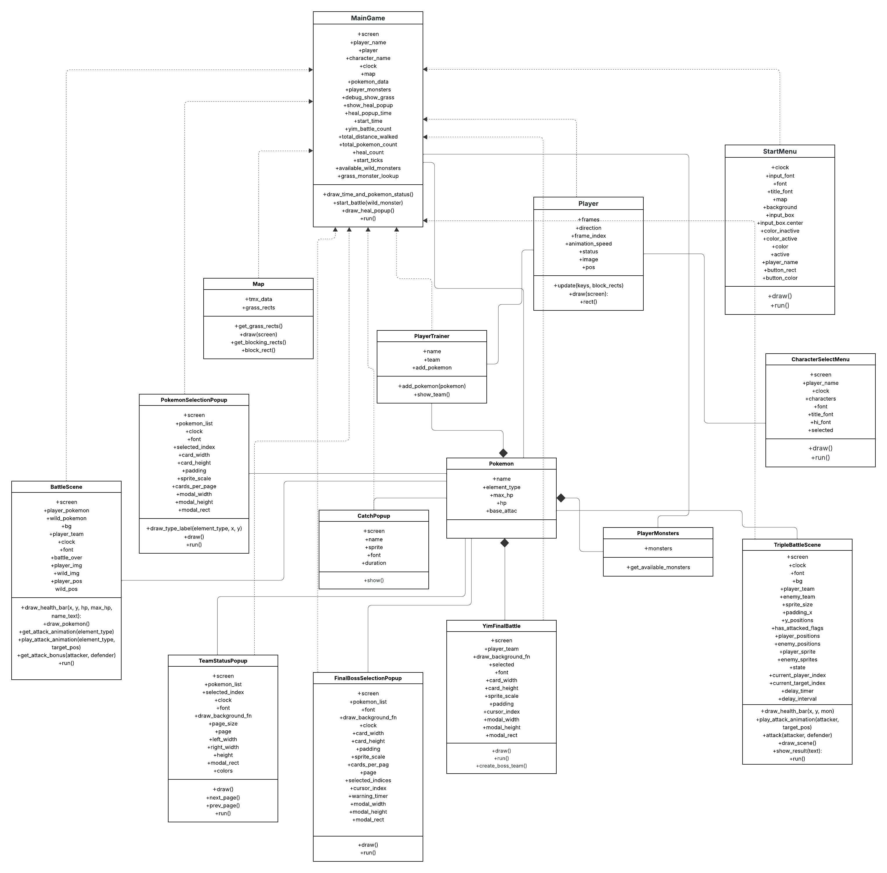

# 🌟 Ultimate Pokémon RPG Adventure – DESCRIPTION.md (Updated)

Welcome to the **Ultimate Pokémon RPG Adventure**, a comprehensive blend of nostalgic RPG charm and modern programming techniques. This project is not just a final assignment—it's a testament to creativity, teamwork, and mastery of Python's object-oriented programming and data handling.

Created using **Python**, **Pygame**, and **Tkinter**, this project not only delivers a functional and engaging Pokémon-inspired RPG, but also offers intelligent data logging and real-time graphical analysis, raising the bar for undergraduate programming.

---

## 🌟 Project Vision

Reimagining Pokémon with:

* Smooth sprite-based animation  
* 1v1 and 3v3 tactical battle mechanics  
* Stylish popups and polished UI  
* Live data logging of player actions  
* Post-game statistical visualization through GUI  

This project is a journey of immersion and innovation.

---

## 🌎 Features Overview

### 👥 Character System

* Choose from multiple animated characters  
* Sprite preview with large-scale selection interface  
* Player name appears above character on the map  

### 🌿 Exploration Mechanics

* Map designed via Tiled (.tmx) with full object layer support  
* Trigger wild Pokémon battle from grass zone (chance-based)  
* Heal Tree for HP recovery with tracked usage count  
* Real-time directional control with 4-frame animated walk  

### 🎨 Visual Design

* Popup windows styled by element (Fire, Grass, Water)  
* Scrollable team selection, modal-based switching  
* Popup after catching Pokémon with full sprite, background, and flair  
* Final boss selection allows choosing 3 Pokémon via scrollable interface  

### ⚔️ Battle Systems

#### 1v1 Wild Encounter

* Animated skill sprites by element  
* HP bar with type and turn logic  
* Smart selection of fighter before battle  
* Capturing and adding Pokémon to team dynamically  

#### 3v3 Boss Fight

* Final fight triggered by contact with boss object  
* Turn-based automatic phase system  
* Alternating attack turns with sprite animation  
* Fainting logic and live fallback  
* Victory popup and stat recording on win/loss  

### 🎵 Audio Integration

* `overworld.ogg` for map exploration  
* `battle.ogg` for combat  
* Seamless transitions using `pygame.mixer`  

---

## 📊 Data Collection & Visualization

### Game Stats Logged to CSV:

* Player Name  
* Time Played (seconds)  
* Distance Walked  
* Total Pokémon Caught  
* Heal Tree Usage  
* Number of Boss Battles (YIM)  
* Character Chosen  

### Visualized using GUI (`GUI.py`)

* Built with `tkinter`, `matplotlib`, and `seaborn`  
* Clean menu UI to select graph type  
* Includes:  
  * Distance Histogram  
  * Play Time Line Chart  
  * Character Selection Pie Chart  
  * Total Pokémon Count Histogram  
  * Heal Tree Usage Bar Chart  
  * YIM Boss Battle Histogram  
  * Summary Stats Table (min, max, mean, mode)  
* Each graph has live description below chart  

### GUI Structure:

* `main.py` ➔ for gameplay  
* `GUI.py` ➔ for visualization  
* Run separately to analyze gameplay sessions  

---

## 🧩 UML Class Diagram

Our game architecture is driven by **Object-Oriented Programming**, visualized below in the UML diagram.

This diagram illustrates the relationships between major classes including gameplay controllers, popups, Pokémon models, and battle logic.

🔗 **Interactive UML Diagram**:  
[View on Lucidchart](https://lucid.app/lucidchart/8d3d2bfe-b6fd-412d-9b55-3e801c33074e/edit?viewport_loc=-1135%2C-5%2C5600%2C3236%2CHWEp-vi-RSFO&invitationId=inv_903bcfe6-c067-49bd-83ae-fe31907cb875)

📷 **UML Diagram Preview:**

> From map rendering to popup management and stat tracking, every component is modular and interconnected. The class diagram above captures the scope of this OOP-driven system.

---

## 📃 Object-Oriented Design Highlights

### Core Classes:

* `MainGame`, `Player`, `Map`, `BattleScene`, `TripleBattleScene`  
* UI Popups: `TeamStatusPopup`, `CatchPopup`, `PokemonSelectionPopup`, `FinalBossSelectionPopup`  

### Patterns:

* State-based turn logic  
* 4-directional walking with sprite frame map  
* Scene management with clean transitions  
* Modular file design for maintainability  

---

## 🎭 Screenshots

* `/screenshots/gameplay/` ➔ Battle, map, popups, UI  
* `/screenshots/visualization/` ➔ Graphs from GUI (`.ipynb` & `.py`)  

---

## 🎓 Learning Outcome

* Implemented game loop, event handling  
* Designed data pipeline from game to analytics  
* Integrated matplotlib/GUI for real-time insights  
* Applied real-world modular programming under deadline  

---

## 🌊 Version History

* **v0.5**: Base map + wild encounter + team UI  
* **v1.0**: Final boss + GUI stats viewer + full polish  

---

## 📹 YouTube Showcase

🎬 [Pokemon Game Video](https://youtu.be/0PVEW_bYXD8)

> "We didn't just play the game. We coded our own universe."

Let the adventure begin. 🚀
